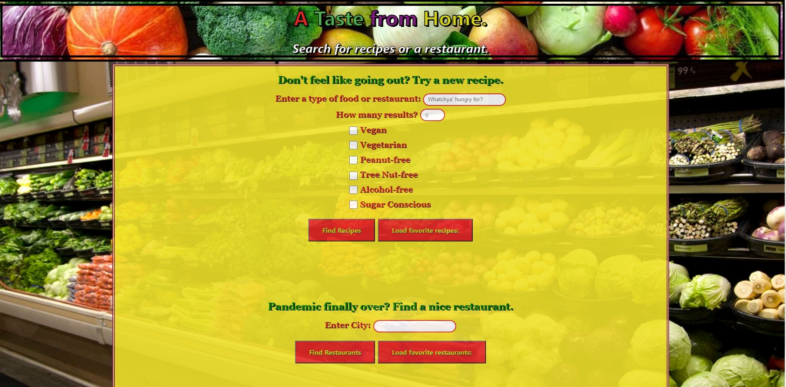

# A Taste From Home (Group 6 Project)

## Table of Contents
1. [General Info](#general-info)
2. [Screenshot](##Screenshot)
3. [Team Members](##Team-members)
4. [Installation & Deployment](##Installation-Deployment)
5. [Future Scope](##Future_scope)
6. [Acknowledgements](##Acknowledgements)

## General Info

Creating a site for an end user to search for restaurants or recipes.

1. User Story - hungry person looking for a specific food. You have a choice to find a restaurant and pick up some food or find a recipe and make your own. Named the site "A taste from home".
2. Project description - utilized 2 API's to get information. Edamam for recipe information and Zomato for the restaurant information. Combined with the Bulma CSS framework and create a working site.
3. Goals - to learn how to use API's, add them together on 1 site, and utilize a CSS framework other than Bootstrap.

The API's, the different framework, and working with a team in a single repository posed a challenge. Challenges of any project start with getting to know team members, assigning roles, assigning tasks, and then remembering to communicate when changes were pushed to the repository. 

The team rose to the challenge and were able to overcome obstacles to complete the project.

## Team Members

Team members and role
1. Reynaldo Bracamonte -- Zomato API & corresponding JS file
2. Dorrian Weber -- Edamam API & corresponding JS file; "favoriting" function (local storage) for recipes & restaurants
3. Adrian Combs -- CSS file (Bulma framework)
4. Jephunney Nduati -- CSS file (Bulma framework)
5. Petr Constantinov -- CSS file (Bulma framework)

<!-- UPDATE SCREENSHOT BEFORE SUBMITTING -->
## Screenshot

## Installation & Deployment
Copy the link and paste it to your browser to install and deploy it. 
https://dorrianweber.github.io/group-6-project/

## Future Scope
Future scope would be to add a Map API to show the restaurant results and possibly directions to that restaurant.  

## Acknowledgments
1. Online resources: Github website, W3 schools, YouTube, RapidAPI, and StackOverflow helped with examples.
2. APIs & links tos documentation: Zomato (https://developers.zomato.com/) Edamam (https://developer.edamam.com/edamam-recipe-api)
3. TA's Ryan Skog and Zac Warner helped challenge and guide in the right direction.